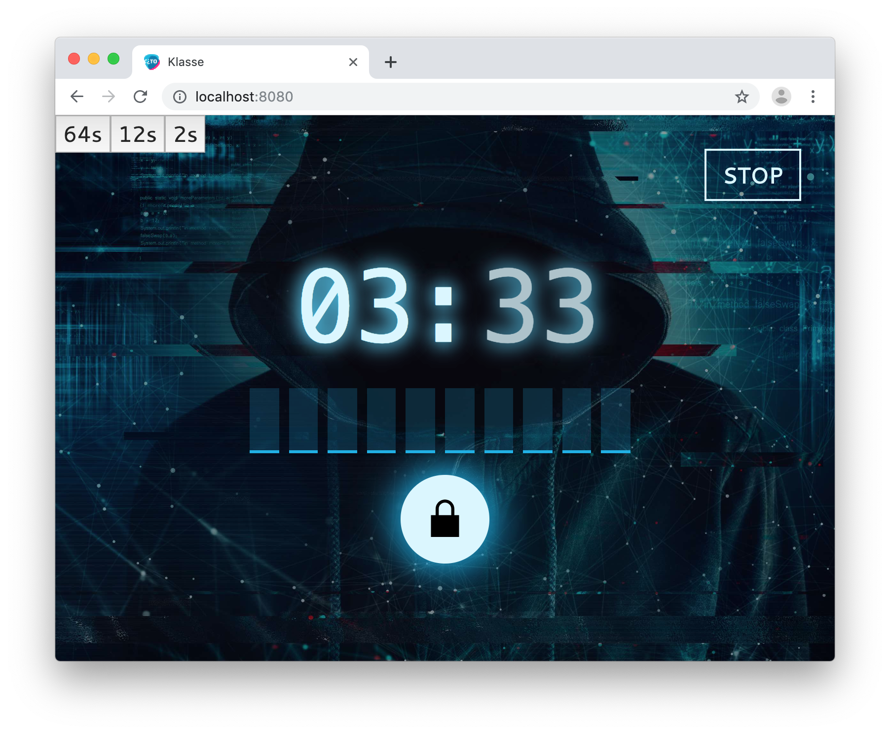

# Klasse

This is a monorepo of project Klasse.

> Cito launches Klasse, a cooperative game for secondary education classes. Your students play this 'escape room-like' game in a race against the clock. Because the solution must be entered within 30 minutes. In the meantime, the teacher can observe how their students work together.

This repository contains the source code for the theme site [https://klasse.cito.nl/](https://klasse.cito.nl/)

For technical documentation see readme in the frontend and backend folder

# RUN

## VS Code
To run this project we recommend using VS Code. A launch file is included. Just clone this folder, open the VSCode workspace folder in the root and press `F5`.
This will start the backend and frontend and open a browser with the Klasse app.

## Development
The demo uses an inmemory database which you can switch to a mongoDB instance (see backend for more info)
In development mode you can influence the clock with the buttons in the top left. They are not visible in production